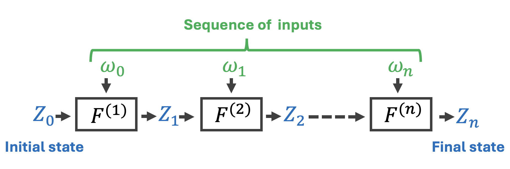
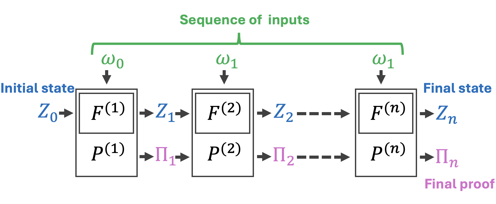
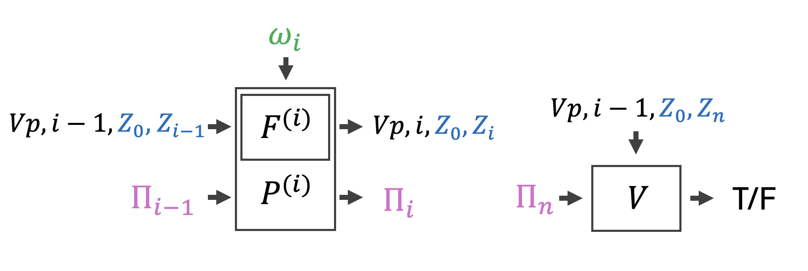
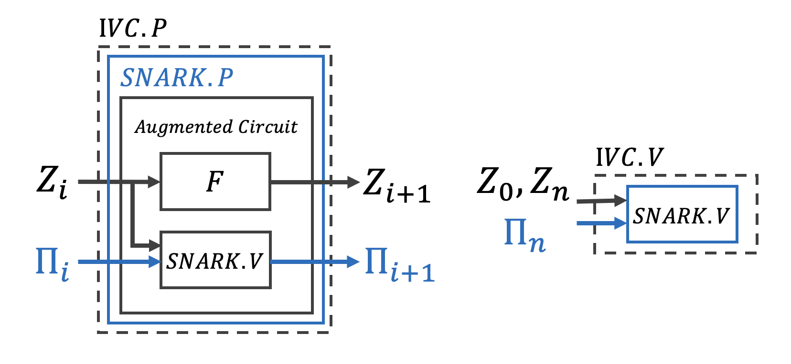
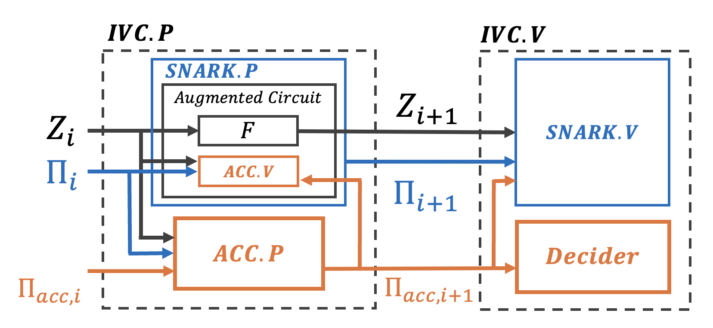
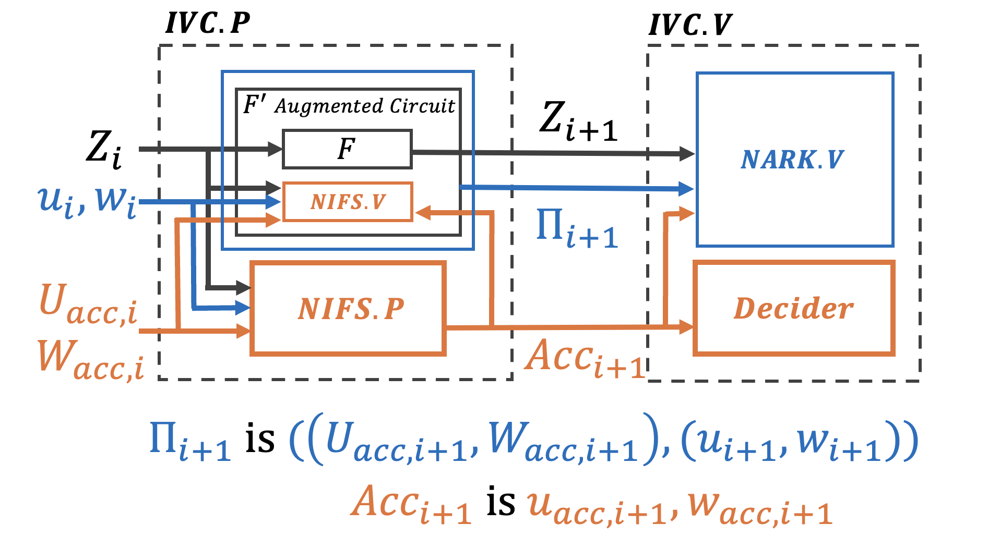

# Nova Folding Introduction Part 1

As stated in the opening line of Nova paper, Nova is a new approach to realize Incrementally Verifiable Computation (IVC). So let’s begin to understand the IVC. 

# 1 Incremental Verifiable Computation

## 1.1 Incremental Computation

First, let's define the Incremental Computation. It involves breaking down a large, complex computation into smaller, manageable steps. In this approach, a fixed function $F$ is applied iteratively to an initial state $Z_0$, along with a sequence of inputs $ω_1, ω_2,..., ω_n$. This process results in a series of intermediate states $Z_1, Z_2, ...Z_i$, ultimately leading to the final state $Z_n$. The main advantage of incremental computation is its ability to handle complex calculations in a step-wise manner, making it easier to manage and update computations based on new inputs or changes.

## 1.2 Incremental Verifiable Computation (IVC)

What happens when verifiability is added to Incremental Computation? Incremental Verifiable Computation (IVC) combines incremental computation with a verification layer. It's not just computing states $Z_i$, but also generating a proof $\Pi_i$ for each step $i$. This proof ensures that every computation step is accurate.

In IVC, the system verifies the transition from a previous state $Z_{i-1}$ to the current state $Z_i$ using a function $F$ and input $ω_i$. Crucially, it utilizes the proof $\Pi_i$ generated for each step $i$ to verify this transition. These proofs form a chain, allowing for the verification that the final state $Z_n$ results from a correctly executed series of computations with the proof $\Pi_n$. 

## 1.3 Constructing IVC Proofs
Here, we explore the essential components that make this verification possible.

### 1.3.1 Proof of Correctness
At the heart of IVC lies the Proof of Correctness. For each step, denoted by $i$, the system generates a proof $\Pi_i$ alongside the computational state $Z_i$. This proof confirmes that the transition from the previous state $Z_{i-1}$ to the current state $Z_i$, through the application of function $F$ with input $\omega_i$, is executed correctly. Specifically, $\Pi_i$ demonstrates that $F(Z_{i-1}, \omega_i)$ precisely results in $Z_i$, effectively assuring the accuracy of this step.

### 1.3.2 Chain of Verification
The Chain of Verification extends the concept of trust throughout the computation sequence. Each proof $\Pi_i$ ensure the accuracy of the computation from the previous state, thereby creating a trust chain that links back to the initial state $Z_0$. This is articulated as $V(vp, (i - 1, Z_0, Z_{i-1}), \Pi_{i-1}) = \{0, 1\}$, signifying the seamless verification of each step in the computation process.

### 1.3.3 The Final Proof $\Pi_n$
Culminating the series of verifications is the final proof $\Pi_n$, which validates that all inputs $\omega_1$ to $\omega_n$ have been accurately processed, leading to the final state $Z_n$. The elegance of $\Pi_n$ lies in its ability to facilitate efficient verification of the entire process without the need to individually recompute each step.

# 2 Mechanisms and problems of ordinary Recursion
Now that you understand IVC, let's review the recursive proofs in zero-knowledge proofs.

## 2.1 Two level SNARK recursion 

This is the diagram of a recursive two-levels SNARK which consists in an inner and an outer proof system. For example, suppose we want to combine a fast $P_1$ proof scheme with another EVM friendly $P_2$ proof scheme.

**Inner Proof System:**
- Public input: $x$
- Witness: $w$
At this level, the SNARK prover $P_1$ is tasked with demonstrating knowledge of a witness $w$ that satisfies the computation $C(x, w) = 0$ and generates an initial proof $\Pi_1$.

**Outer Proof System:**
- Public input: Verifying parameters $vp$ and $x$
- Witness: $\Pi_1$

In the outer layer, a different SNARK prover $P_2$ proves the existence of a valid proof $\Pi_1$ from the Inner Proof System. This is done by showing that the verifier $V$, equipped with parameters $vp$, confirms the legitimacy of $x$ and $\Pi_1$ by outputting $1$ and creating a new proof $\Pi_2$.

The process effectively demonstrates not only the validity of the initial computation $C(x, w)$ but also the verifier's acknowledgment of this validity through the second-level proof $\Pi_2$.

This is the concept of the recursion, unlike IVC, which is characterized by its step-wise computation and verification process. So next, let's think about SNARK-based IVC naively.

## 2.2 Naive SNARK-Based IVC

The diagram shows a Naive SNARK-Based IVC. At each step $i$, the IVC state $Z_i$ is transformed by a function $F$ to generate a new state $Z_{i+1}$ and a proof $\Pi_i$ is verified by the SNARK verifier $SNARK.V$. This verification aims to ensure the correctness of the transition from the previous state $Z_i$ to the next $Z_{i+1}$.

There is an augmented circuit that integrates both $F$ and $SNARK.V$, where $SNARK.P$ is responsible for generating the next proof $\Pi_{i+1}$. This proof ensures the integrity of the new state $Z_{i+1}$.

In the final verification step, the SNARK verifier $SNARK.V$ uses the final state $Z_n$, the proof $\Pi_n$, and the verification key $vk$ to check the entire sequence's integrity.

**Problem of Naive SNARK-Based IVC**
If the naive SNARK adopts a general pairing-based approach, this method significantly increases recursion overhead and prolongs the overall proving time. The reason is the internal Verifier's need to repetitively handle pairing and related processes at each step.

[zkPairing](https://0xparc.org/blog/zk-pairing-1) and [circom-pairing](https://github.com/yi-sun/circom-pairing) are the works done by the 0xParc, describing an experimental implementation and benchmarking for verifying pairings in Circom circuit.

| Metric                 | Optimal Ate Pairing |
|------------------------|---------------------------|
| Constraints            | 11.4M                     |
| Compilation Time       | 1.9 hrs                   |
| Witness Generation Time| 1 min                     |
| Proving Key Size       | 6.5 GB                    |
| Proof Generation Time  | 52 sec                    |
| Proof Verification Time| 1 sec                     |

From their benchmarks, for example, the Optimal Ate pairing metric cites a Proving time of 52 seconds and a Proof verification time of 1 second. From the perspective of Naive SNARK-Based IVC, this implies that each step will take at least 52 seconds for Proving time and 1 second for Proof verification time. As the number of IVC steps increases to 100 or even 1000, this would lead to substantial time consumption and overhead. Therefore, this approach may not be the most efficient for implementing IVC.

## 2.3 FRI family
So the next topic is what would be the outcome of adopting FRI commitments instead of  polynomial commitments and pairings in ZKP schemes? Such schemes, utilizing FRI commitments, are known as zkSTARKs or the FRI-Family. zkSTARKs are known for their lack of a trusted setup requirement and their quantum resistance, a characteristic owing to the use of hash functions in Merkle tree commitments.

Another feature is the ease of recursive proofs. For instance, in Plonky2, despite the heavy computational demand due to Merkle Proofs constructed with hash functions, Plonk's custom gates enable the streamlined execution of recursive proofs in poly-log.

Individual proofs are independent, making them suitable for parallelization. Some zkVM projects prefer it for its fast recursive proofs and ease of parallelization.

However, a disadvantage is the expansion in Proof Size attributed to FRI's Merkle Proofs. This enlargement escalates the call data and consequently raising the gas cost for verification on Ethereum, reputedly four times that of Groth16.

While general zkSNARKs typically leverage 256-bit BN256 elliptic curve cryptography for security, zkSTARKs opt for a 64-bit Goldilocks field, supplemented by a 128-bit extension field, to enhance CPU performance. This choice of a smaller finite field, though, may raise concerns regarding the level of security guaranteed by the Schwartz-Zippel lemma.

## 2.4 Accumulation
Since Halo2 has also been actively used recently, I would like to mention about how it works. In Halo 2, the expensive part of the verification is deferred to something called an accumulator, so that instead of verifying SNARK at each step of the IVC, it would only need to be checked once at the end.

Specifically, Accumulator can take two IPA (Inner Product Argument) proofs and compress them into a single IPA proof. This compressed proof maintains the same validity as the original two proofs while being accumulated at each step.

At each step $i$, the computation produces a new state $Z_{i+1}$ from the previous state $Z_i$ through a function $F$. Concurrently, the accumulator $ACC$ updates the state from $\Pi_{acc,i}$ to $\Pi_{acc,i+1}$ using the proof function $ACC.P$, based on $Z_i, \Pi_i$, and $\Pi_{acc, i}$. This new accumulator state $\Pi_{acc,i+1}$ is then verified through a verification function $ACC.V$.

The augmented circuit integrates both $F$ and $ACC.V$ to ensure the correctness of these operations. The SNARK prover $SNARK.P$ generates a proof $\Pi_{i+1}$, demonstrating that the inputs and outputs satisfy the augmented circuit, signifying a valid transition from $Z_i$ to $Z_{i+1}$ and the corresponding accumulator state transition.

The final process involves the SNARK verifier $SNARK.V$ executing the final verification using the final state $Z_n$, proof $\Pi_n$, and the accumulator $\Pi_{acc,n}$. Additionally, the Decider algorithm $Decider$ is applied to the final accumulator $\Pi_{acc,n}$, affirming the validity of all preceding proofs if successful.

Accumulation compress two SNARK proofs, such as the Inner Product Argument (IPA), into one effectively. This method reduces the need for pairing at each step, thereby enhancing the efficiency of the overall verification process.

While the accumulation approach in Halo2, which compresses commitments like the Inner Product Argument (IPA) into a single one, effectively addresses some inefficiencies, it still necessitates generating SNARK proofs at each IVC step. 

# 3 Nova Folding
## 3.1 Features of Nova Folding

Unlike the traditional accumulation method, Folding scheme can fold the two arithmetization and it's instances before the commitment into one. In Nova, it can fold the two R1CS instances into one.
In this picture, $u$ and $w$ represent instance and witness pair for the R1CS. This breakthrough implies that, within the IVC steps, there's no longer a need to generate each SNARK proof and verify it for each step except for the final one.  This advancement makes it more efficient IVC implementations.

Here are some of Nova's features.
- Adoption of Folding Schemes, making two NP(R1CS) instances into one.
- The verifier circuit is constant in size, dominated by two group scalar multiplications
- The prover's work is primarily composed of two multi-exponentiations.
- Does not require FFTs and Trusted Setup.
- [Nova is 100 times faster than plonky2.](https://x.com/srinathtv/status/1690825525915492352?s=20)

## 3.2 Other Folding Schemes
Since the invention of Nova Folding, there has been an evolution in the Folding Scheme landscape. The following is a brief introduction of their features.

- [Sangria](https://geometry.xyz/notebook/sangria-a-folding-scheme-for-plonk): Adapts Nova's Folding scheme for PLONK circuits.
- [SuperNova](https://eprint.iacr.org/2022/1758): Generalizes Nova to allow non uniform functions at each step.
- [HyperNova](https://eprint.iacr.org/2023/573): R1CS, PLONKish, and AIR can be represented as Customizable Constraint Systems (CCS) and do folding CCS. More efficient than Nova and Sangria.
- [ProtoStar](https://eprint.iacr.org/2023/620): Extends Nova and Sangria's efficiency in recursive circuits, supports Plonkish circuits, and enables non-uniform IVC.
- [ProtoGalaxy](https://eprint.iacr.org/2023/1106): Enables efficient handling of multiple instances with minimal verifier effort, based on the ProtoStar model.
- [CycleFold](https://eprint.iacr.org/2023/1192): Realizes IVC with a minimal elliptic curve approach, reducing complexity and enhancing the efficiency of recursive SNARK arguments.
- [KiloNova](https://eprint.iacr.org/2023/1579): Utilize generic folding schemes, delivers a non-uniform PCD system that optimizes multi-party computations with zero-knowledge efficiency.
- [LatticeFold](https://x.com/Charles_Chen533/status/1759598829245178355?s=20): The first lattice-based folding protocol to provide post-quantum resistance and have the same performance as Hypernova.

# 4 Reference
- [Advances in the Efficiency of Succinct Proofs - Ying Tong](https://youtu.be/KSGE6n66W1M?si=q3BwOvgRFrvOQp3z)
- [ZKP MOOC Lecture 10: Recursive SNARKs](https://youtu.be/0LW-qeVe6QI?si=5OHATEeT1EFKNjAS)
- [Nova: Recursive Zero-Knowledge Arguments from Folding Schemes](https://eprint.iacr.org/2021/370)
- [From Folding Hype to Multivariate Setting Rescue. A 2023 lookback | CPerezz | PROGCRYPTO](https://youtu.be/zru9-6tE7eY?si=ClgzlTwE5KUjNxYh)
- [An incomplete guide to Folding: Nova, Sangria, SuperNova, HyperNova, Protostar](https://taiko.mirror.xyz/tk8LoE-rC2w0MJ4wCWwaJwbq8-Ih8DXnLUf7aJX1FbU)
- [zkStudyClub: Supernova (Srinath Setty - MS Research)](https://youtu.be/ilrvqajkrYY?si=ZOl33MOhYfywTPOo)
- [CCS & HyperNova with Srinath - Folding Schemes FTW](https://www.youtube.com/live/pDFmANwwIoY?si=H6EtUItdawFFyYJJ)
- [Nova: Recursive Zero-Knowledge Arguments from Folding Schemes - Srinath Setty](https://youtu.be/mY-LWXKsBLc?si=JRf7E2IkEEVHNzzb)
- [(Workshop) [Super] Nova [Scotia]: Unpacking Nova](https://youtu.be/N6RW_YhLMNw?si=7KWZmQ0KOmmIxL49)
- [zkPairing](https://0xparc.org/blog/zk-pairing-1)
- [ZK7: Latest developments in Halo2 by Ying Tong Lai](https://youtu.be/V1RgGn1GtqM?si=IlofaKNNH79doSmW)
- [The Halo2 Book](https://zcash.github.io/halo2)
- [Scalable, transparent, and post-quantum secure computational integrity](https://eprint.iacr.org/2018/046)
